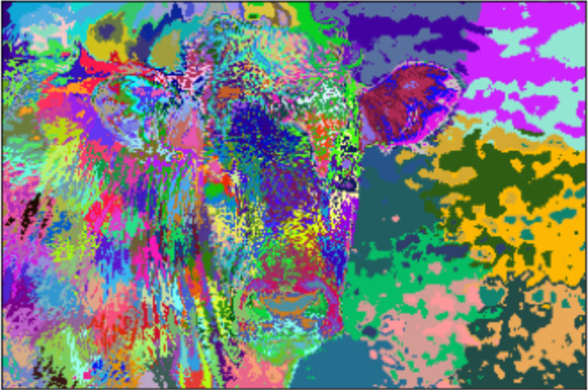

# Superpixel Clustering using KMeans and SLIC

A superpixel can be defined as a group of pixels that share common characteristics (like pixel intensity ). Superpixels are becoming useful in many Computer Vision and Image processing algorithms like Image Segmentation, Semantic labeling, Object detection and tracking etc because of the following-

-   They carry more information than pixels.
-   Superpixels have a perceptual meaning since pixels belonging to a given superpixel share similar visual properties.
-   They provide a convenient and compact representation of images that can be very useful for computationally demanding problems.

This project aims to generate superpixels from the [MSRCv1 dataset](http://download.microsoft.com/download/A/1/1/A116CD80-5B79-407E-B5CE-3D5C6ED8B0D5/msrc_objcategimagedatabase_v1.zip).
We implement superpixel clustering in the following ways : 

 1. KMeans clustering algorithm in the three dimensional RGB space.
 2. KMeans clustering algorithm in the five dimensional RGB and XY space.
 3. Weighted KMeans algorithm with different weights for RGB and XY for each image.

  
   
  

 5. Implementing the [SLIC algorithm](https://www.iro.umontreal.ca/~mignotte/IFT6150/Articles/SLIC_Superpixels.pdf) for improved superpixel generation.
 6. Enforcing connectivity by assigning small superpixels to its nearest cluster.
 
 Further details and the code 
